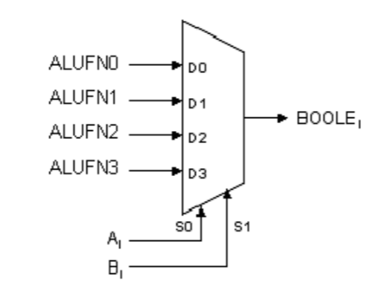
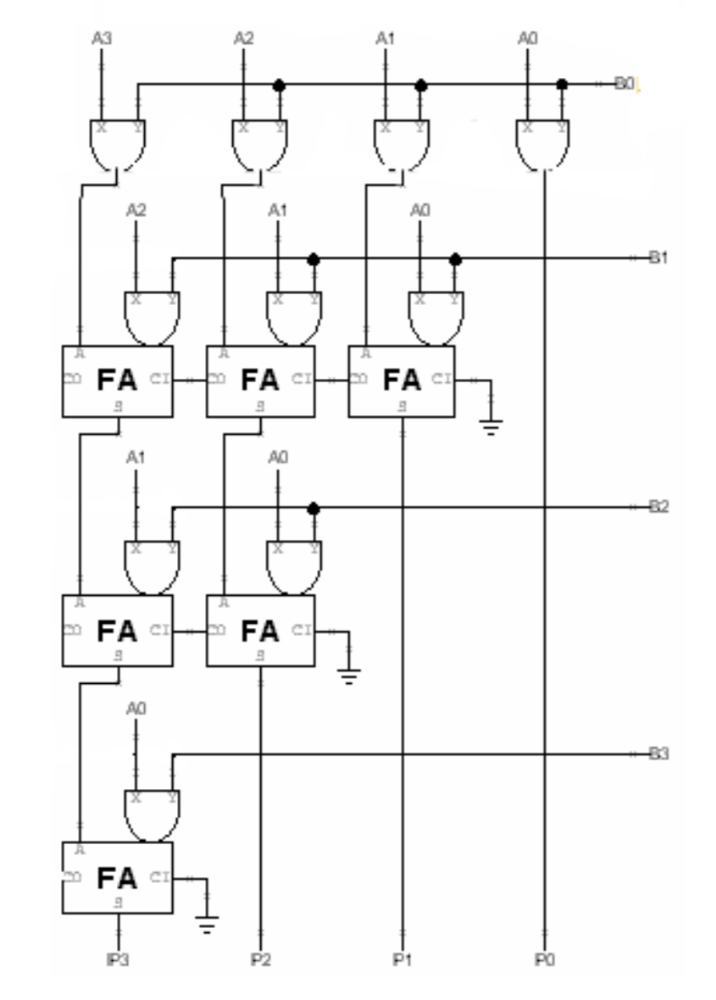
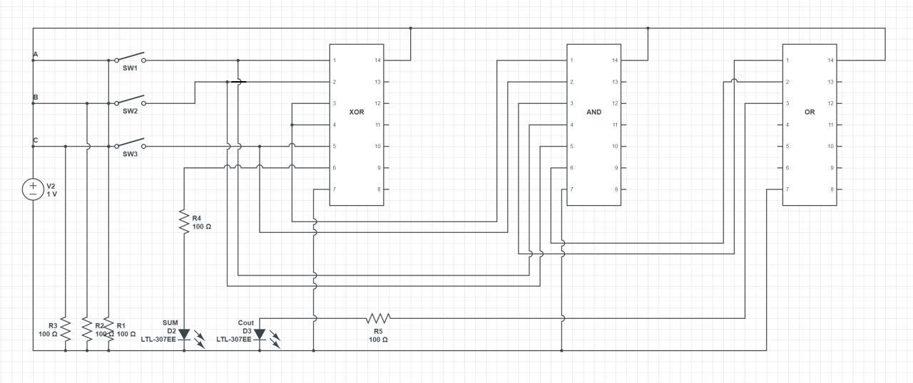
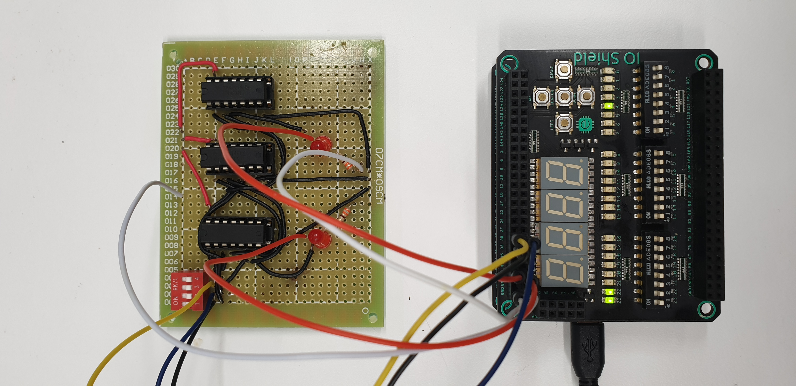
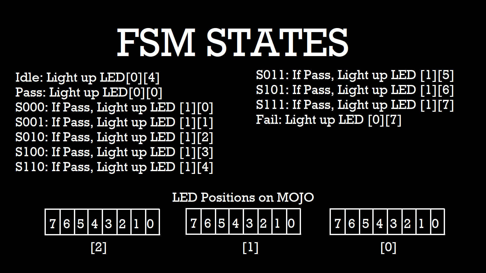

## 30 Oct 2019 - 2 Nov 2019
# The day I realized I need to make a log book
> A Good Friend of Mine:  
_"Do you know we have a log book that we need to write and will be checked 
during the first check off?"_

Me:  


Ok yes I just remembered that recently so here is my first entry.

---

Here I'll be revising my labs and Mini Hardware Project.

### **Lab 1**
This lab mostly focused on trying to get familiarized with jsim syntax and the 
CMOS.

Some important points to note:
- Always name the nodes first (prefferably on the circuit drawing) to avoid
  any confusion and it makes your life easier, so why not?
- '0' is always 0 / GND
- Zoom in when in waveform window to get more accurate measurement

One of the syntax for jsim: 

```
M[name] d g s b [type] w l
```  

M is mosfet, `[name]` is equivalent to variable name, d g s b is respectively
drain, gate, source, and bulk, `[type]` is either PFET or NFET, and w and l are
width and length.


The last part of lab 1 which is to esign a logic gate given a truth table

| A | B | C | F |
|:-:|:-:|:-:|:-:|
| 0 | 0 | 0 | 0 |
| 1 | 0 | 0 | 0 |
| 0 | 1 | 0 | 0 |
| 0 | 0 | 1 | 1 |
| 0 | 1 | 1 | 1 |
| 1 | 1 | 0 | 1 |
| 1 | 0 | 1 | 1 |
| 1 | 1 | 1 | 1 |

From the truth table above, the sum of product will be:  
```
F = A.B.C + A.~B.C + ~A.B.C
```  
Simplified,  
```
F = A.C + ~A.B.C  
F = C.(A+B)
```

The circuit drawn from the sum of product is:  


### **Lab 2**
In this lab we made the full adder 4 bit. We created it with ripple carry
architecture, which is cascading the full adders.


Each of the full adder consisted of 2 XOR gate and 1 3-input NAND gate and 3 2-input NAND gate.

The formula for the full adder: (^ is XOR)  
```
S = A ^ B ^ C
Cout = A.B + A.C + B.C
```


The testing of this full adder is with 3 clock with different period. The goal
is to achieve all combinations of inputs, so we used 3 clock of period 10ns,
20ns, and 40ns.


### **Lab 3**

ALU!! This week's topic is very interesting. It was something new and I was
able to se different parts working together to be a "unit".

The ALU that we have to make consisted of 4 different parts. Adder, shifter,
boolean, and compare.

First, adder.
The adder is using the same architecture as last week's, which was ripple
carry. The difference is that last week's was 4 bit, and this adder is 32 bit.
It is also controlled by a control signal, ALUFN bit 0.  
Below is a picture of the adder.

The 32 bits of B will be "XOR-ed" with the ALUFN (or AFN in the picture). This acts as the 2's complement when the ALUFN is 1 which indicates subtraction ( A - B = A + (-B) ).  
Z is the NOR of all bits of S, which will be true if all bits are 0.  
V is to detect overflow, which is when the sign of the result is opposite of the inputs. This only applies for addition and not subtraction.

Second, compare.
Compare uses Z, V, and N from the adder. By doing A-B, the result of Z, V, and N can be used to compare A to B.  
For A == B, ```F = Z``` as Z indicates all bits are 0.  
For A < B, ```F = N ^ V``` as A - B will result in negative if A is less than B, but negative could mean overflow too so we have to make sure it's not by "XOR-ing" N and V.  
For A <= B, ```F = Z + (N ^ V)``` which is the OR of less than and equal.

Third, boolean.  
Boolean uses a multiplexer where ALUFN signals as the input and A and B as the selector signals, as pictured below.  


For example, for the boolean AND, the alufn from 0 to 3 would be 0 0 0 1.  
When A is 1 and B is 1, it will choose the last option which is 1, and for other combinations where there will be at least 1 '0', the multiplexer will choose 0. This shows the multiplexer works as the logic gate AND.

Other combinations: (ALUFN is written from bit 0 to 3)  
OR: 0111
XOR: 0110
“A”: 0101

Last, shifter.
Shifter has 3 type, shift left, shift right, and shift right arithmetic.  
Simple explanation for shift left and shift right: (also called shift left/right logical)  
  


For shift right arithmetic, the difference is that the signed bit (the most significant bit) is "kept". So instead of inserting 0 at the most significant bit like shift right logical, it "keeps" the original bit. If the original bit is 0 then insert 0, if 1 then insert 1. Illustrated below.  


The shifter is created by cascading 5 "shifter units" are what i call them. 1 Shifter unit shifts the input by different amount. For 32 bit shifter. there will be 5 shifter units for 1 bit, 2 bit, 4 bit, 8 bit, and 16 bit.

An additional part is multiply.
It uses this logic illustrated below.  


By using full adder and logic gate AND for the multiply, cascading them together in this architecture taken from the handout,  
  
One can make the multiply part for ALU.  
Because the writing on the jsim netlist was very tedious, I created a simple python script to part of the netlist for me.

---
---

## Mini Hardware Project
During the first lab, me and my group managed to make the half adder and we had extra time, so we decided to make the full adder too and test it on the breadboard.

So we have divided our work, my first part was to create the circuit diagram. Below is the circuit diagram that I had created.  


Together we soldered this into the circuit board, and creaded a FSM (Finite State Machine) in MOJO to automate the testing of our full adder.  
  
The FSM consisted of all the possible inputs to the full adder.  
  
The starting state was Idle, and when the user press the button on the MOJO at the right timing of the CLK inside MOJO, it will move to state S000 where the input is 000 for A,B,Cin. If it passes. it will move to the next state(S001,S010, etc) and if at any state it fails, it will immediately jump to Fail state and light up the specific LED that indicates failure.

We also enabled manual testing using the mojo, setting the input manually using the switches and showing the output to the LED on MOJO. A more detailed explanation on the testing can be watched here.  
[](https://www.youtube.com/watch?v=Yux4Vubd5nw&feature=youtu.be)