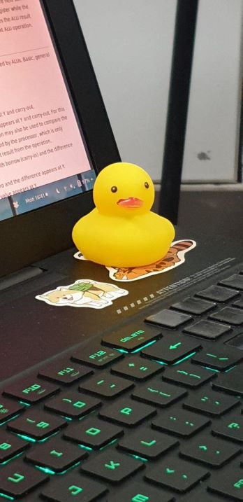
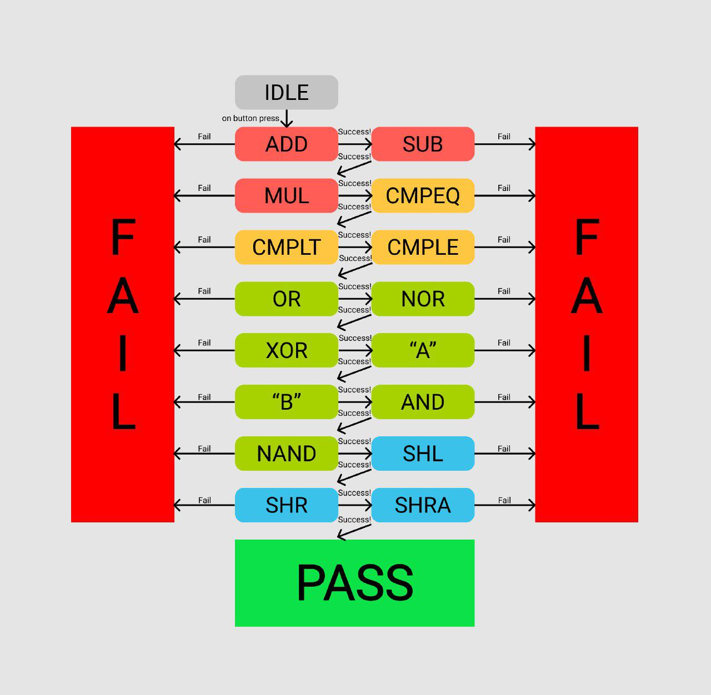

## 4 Nov 2019 - 6 Nov 2019
# The day we combined our ALU in MOJO!

We had divided the work a few days ago so that each of us will create 1 part of the ALU. I will be making the shifter, Matthew will make boolean, Zack will make adder, and Jia Yi will make compare. 

Each of us created a lucid file each to make each part a module (shifter module, adder module, etc) to make it modular so that we can reuse it if we need to in other code

We met today to combine our parts and created an `alu.luc` file that uses all the other parts (created as a module).

After we had combined them, we had to map out the pins and switches and leds to show outputs and take inputs. We had our share of trying to debug what was the problem when we connected the pins to the VCC for input '1' and GND for input '0'.

Fun fact: We had a duckie to help us debug!  

We find some mistakes that we made when we created our parts and have fixed it, such as:
- Did not specify as sign bits in the shifter for shift arithmetic
- Forgot to XOR the `B` with `ALUFN` to do the 2's complement in the formula for V that will be used to compare
- Written down the wrong `ALUFN` signal

We created another FSM to automatically test our alu, and we also created a way to manually test our alu. The FSM states diagram are illustrated below.

During the debugging session, I had noticed that I made some careless mistakes that I should be able to avoid in the future if I paid more attention to the details when I code, especially when I copy paste some parts of the code that repeats the earlier part of my code and I forgot to change some values (like the `ALUFN`) and ended up with the wrong answer.

[Here's a link to our github repo for this ALU for our source code](https://github.com/zackteo/16-bit-ALU-mojo)