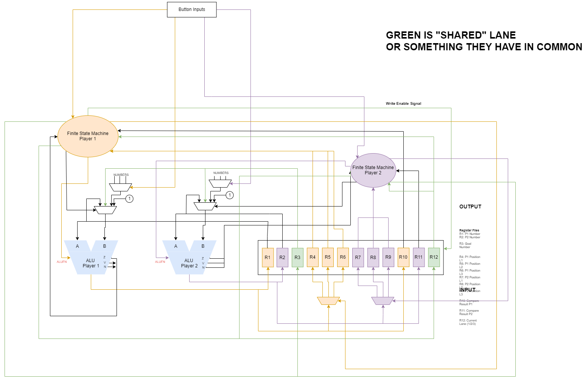
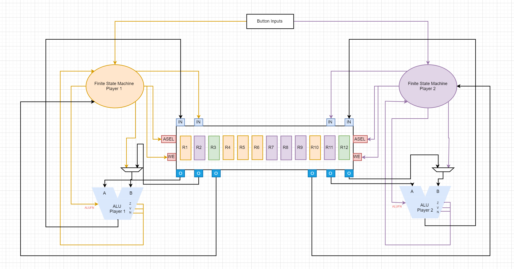
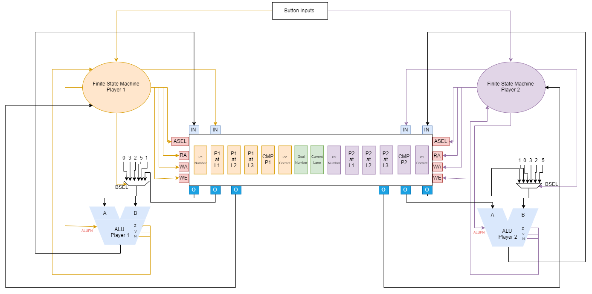

# Data Path Design

I was tasked to make the data path, and we have gone through several versions of it.

First version:  

We decide that this was to complicated so we decided to reduce the amount of connections for the register and make it so that the FSM will be the one sending out the control signals for the muxes instead of the button input module. We also decided to remove the button input modules and make it so that the button inputs will go to FSM straight away to make it faster (less "path" traveled).

Second version:

We made it so that the registers now has 2 inputs and 3 outputs, with ASEL signal to choose which register to go to A of ALU, WA to choose which register. FSM will also give BSEL to the mux that chooses whether it will be from FSM(constant numbers) or from register(goal number).

We have met with prof Oka and also discussed more on this, we decided to change where the constant numbers will be coming from, and also added RA (read address) to separate from WA (write address).

We have changed it so that the constant numbers will just be connected immediately to the muxes and FSM will only give out signals.

Third/Final version:
