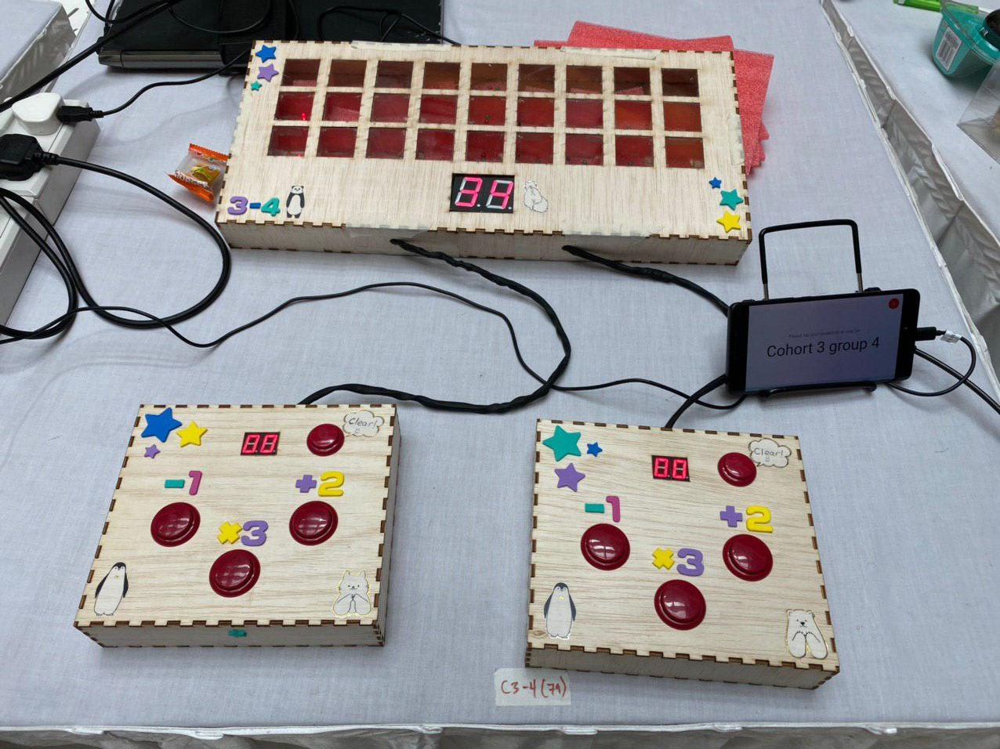

# Exhibition Time!

---
## Our setup:

I helped with setting it up at the booth before 10am, and my friend Matthew had to try and program the MOJO again as previously we had problems trying to program the MOJO.

After set up is finished, I went to my 50.001 booth and attended to it. A few times during the exhibition my friend tell me some updates, some of them are:

- People are having fun playing the game!!
- OUR GAME GOT CHOSEN TO BE TAKEN TO DSL! This was the happiest news I could get when attending my 50.001 booth!

But yes, I only have this much for this log as for the whole day I was attending 50.001 booth.
