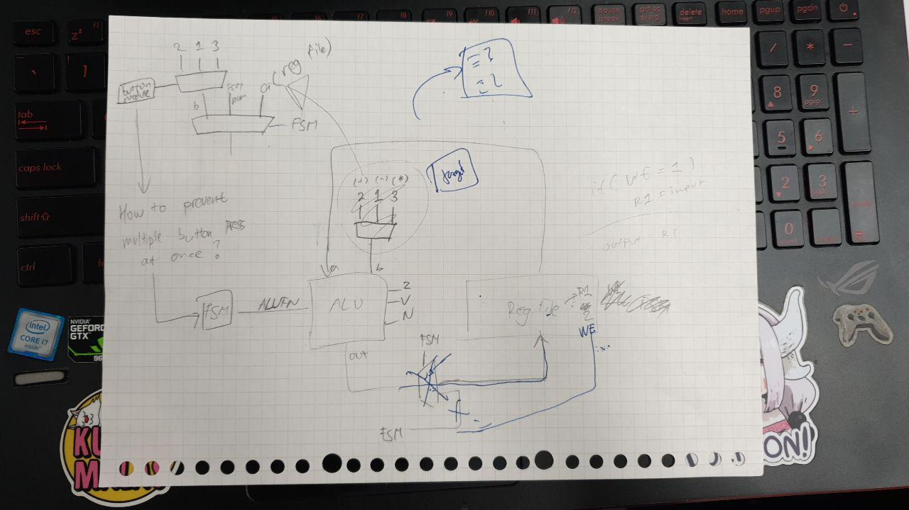

<h1>Designing Our Game!</h1>

We had a meeting on 11/11 to discuss and finalize what game we are going to make for our 1D project. We had each come up with some ideas before meeting, and here are some of our ideas and reasons why we accepted/rejected it.

---
## Snake Game
  
We had decided that snake game would be slightly complicated to implement, as a normal 1 player snake game would require us to increase the length of the snake everytime it eats something, and we have limited number of pins on MOJO to connect to the LED.

---
## Typing Game
  
We had considered this to be our game. So there would be a word/sentence shown and the player would have to type it in correctly to get points. As a normal keyboard (with 26 alphabets) might be too much pins to connect to MOJO, we thought of reducing it by using symbols. But, the problem of displaying the word comes to our mind as we are not sure on how to do it, so we had decided not to make this type of game.

---
## Unnamed Math Game
We had thought of several games that uses math as its main mechanic. We decided on doing a math number manipulation(?) kind of thing. So there will be a number shown for both player, and each player will have 3 button (+2, -1, *5). The player will have to use those 3 buttons to manipulate a starting number they have to the one shown for both player. (The numbers on the button is still not fixed yet)

We have several version we have thought of:  
1. The current "number" that the player is at will not be shown, but the player will be given an extra button to "reset" their number to 0 in case they forgot their number and an LED to indicate that they had successfully clear their number (checks if the number is equal to 0).

2. The player will be shown their current number, but they will not be given the "reset" button.

3. Provide both mode, the first one would be for "hard mode" and the second one would be the normal mode.

Both player will be racing to "capture the flag"!

|
A
|
-
|
-
|
-
|
-
|
flag
|
-
|
-
|
-
|
-
|
B
|
|-|-|-|-|-|----|-|-|-|-|-|

'-' is empty spot, A is player 1's position, B is player 2's position. Everytime a player manage to get the number, they will advance by 1 step.

If player 1 manage to complete 1 problem:

|
-
|
A
|
-
|
-
|
-
|
flag
|
-
|
-
|
-
|
-
|
B
|
|-|-|-|-|-|----|-|-|-|-|-|

Until the one player reach the flag, they will keep playing. There will be 3 "lanes", after the first lane's flag is captured then it will automatically move to the next lane. Each time a player captured a flag, their score will be incremented by 1.  
(All of this will be in the form of LED "panels", an LED behind an acrylic "square" panel)

Our _scibble_:  

Our _Data Path_:

Our _approximate shopping list_:
- "Transluscent" acrylic sheet (A3)
- Wood 3mm and 6mm
- Bunch of wires
- PCB (only if needed)
- 40 LED
- 6 7-segments
- 10 buttons (arcade like buttons)
- 1 switch

### Checkoff - Suggestions and Comments
We did the checkoff on Wednesday and the comments and suggestions are down below.

- The way the button is currently is might result in a dynamic where the player not using all 3 buttons. Ideally the gameplay should make it so that the player requires/encouraged to use all buttons
- Take into accound the difficulty to learn the game when designing it
- For 'hard mode' that we had thought of (version 1 above), we could give some hints to make it not impossible/too hard. The hint could be some LEDs that shows when it's even/odd
- Elaborate more on the state transition diagram, the data path, and the components of register file
- Add a Write Enable (WE) signal for register file
- Possible modifications - add timer for each question and make it faster every time they manage to solve a question
- Deide on how to choose/generate the questions (randomized? fixed?)

Now, onto working on improving the design and then on the game!

