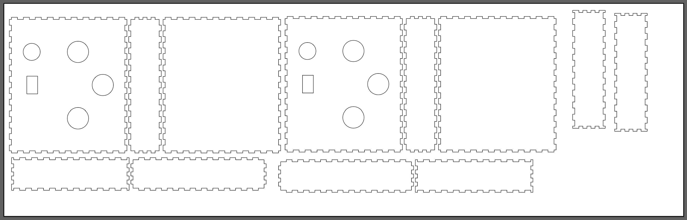
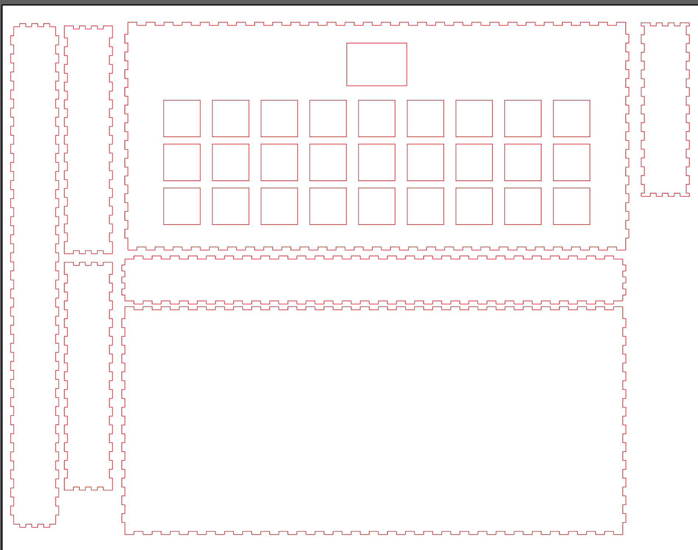
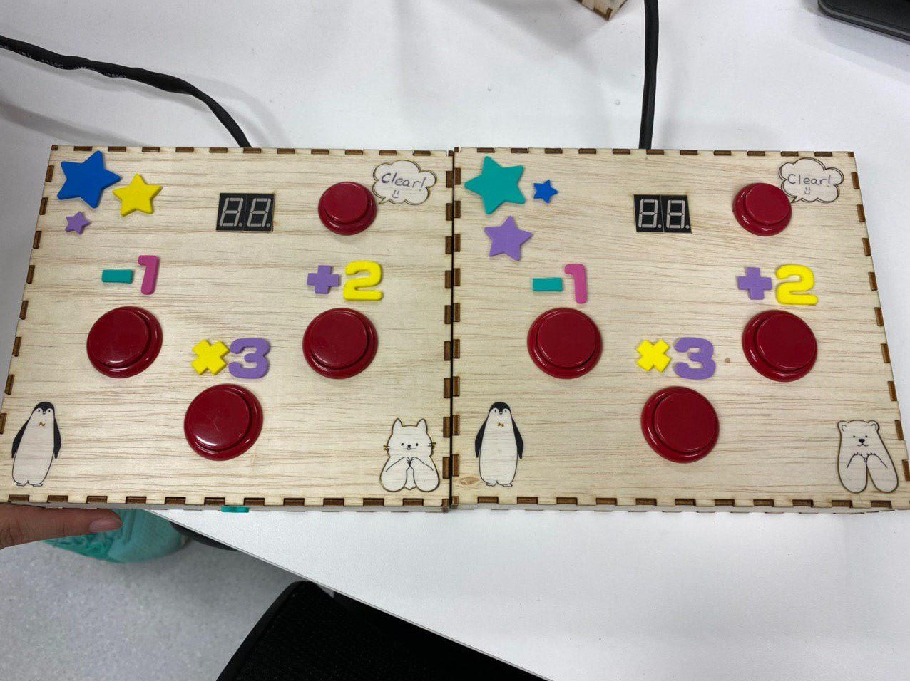
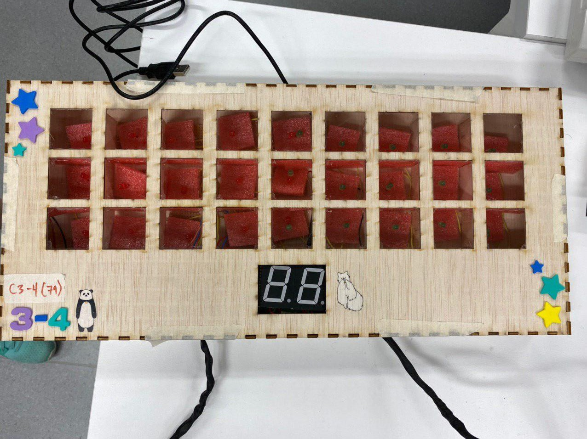
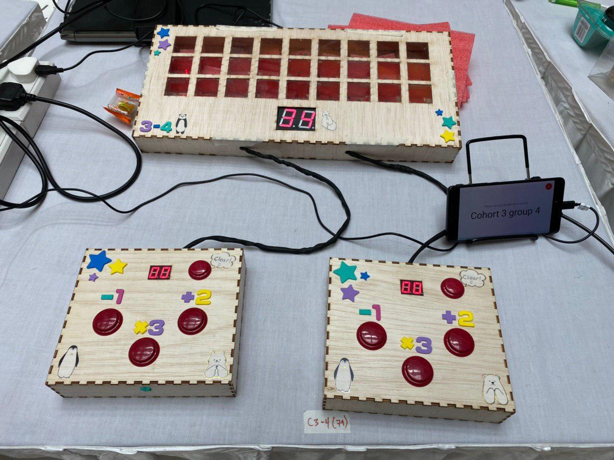

# Hardware Building of the Game (?)

Finally it's time for us, ISTD students, to build the hardware of the game...

To be honest, I was not "afraid" per se, but it's more like I know it will be annoying to debug it and a lot of work. And it did end up taking a lot of our time to debug.

## Lasercutting Stuffs
We used wood for the boxes and controllers. We decided to separate them to give more space to each player if we made controllers.

Below is the lasercut file of the controller.

Here is the lasercut file for the main box. The acrylic panel is the same size as the 27 squares we had here.

After cutting everything, we soldered the wires to the buttons and made the controller. We had decided to use arcade style buttons as it's more comfortable to "press" or "smash" while playing.

## The finished product:  
### Controller:

### Main Box:

### Setup:

We decided to heatshrink the wires that connects the controller to the MOJO inside the main box as it was too messy and we didnt want any risk of it getting tangled. We put foams under each LED (Can be seen from the picture of the main box) to hide the circuit under it.

We had several wrong soldering incidents and some LED broke on their own so it took awhile to finish the main box.

Now that hardware is done, now is exhibition time!
